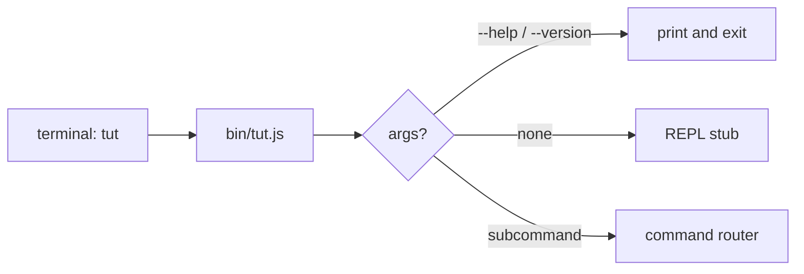

# WO-1 diagram

```mermaid
flowchart LR
  A[terminal: tut] --> B[bin/tut.js]
  B --> C{args?}
  C -->|--help / --version| D[print and exit]
  C -->|none| E[REPL stub]
  C -->|subcommand| F[command router]
```
