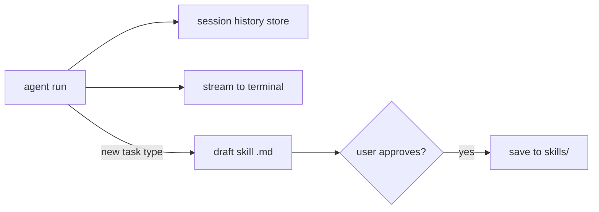

# WO-10 diagram

```mermaid
flowchart LR
  A[agent run] --> H[session history store]
  A --> S[stream to terminal]
  A -->|new task type| K[draft skill .md]
  K --> U{user approves?}
  U -->|yes| F[save to skills/]
```
