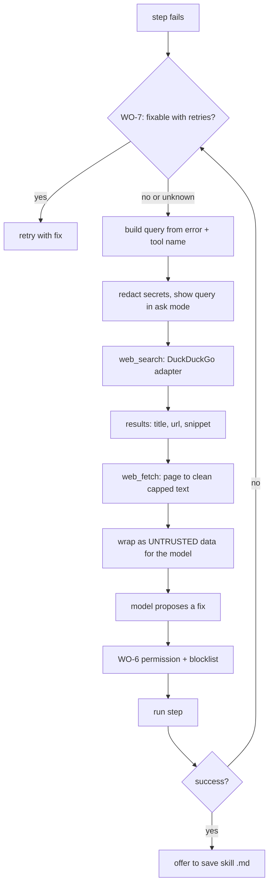

# WO-11 diagram

```mermaid
flowchart TD
  A[step fails] --> B{WO-7: fixable with retries?}
  B -->|yes| R[retry with fix]
  B -->|no or unknown| Q[build query from error + tool name]
  Q --> S[redact secrets, show query in ask mode]
  S --> D[web_search: DuckDuckGo adapter]
  D --> L[results: title, url, snippet]
  L --> F[web_fetch: page to clean capped text]
  F --> U[wrap as UNTRUSTED data for the model]
  U --> M[model proposes a fix]
  M --> G[WO-6 permission + blocklist]
  G --> X[run step]
  X --> Y{success?}
  Y -->|yes| K[offer to save skill .md]
  Y -->|no| B
```
