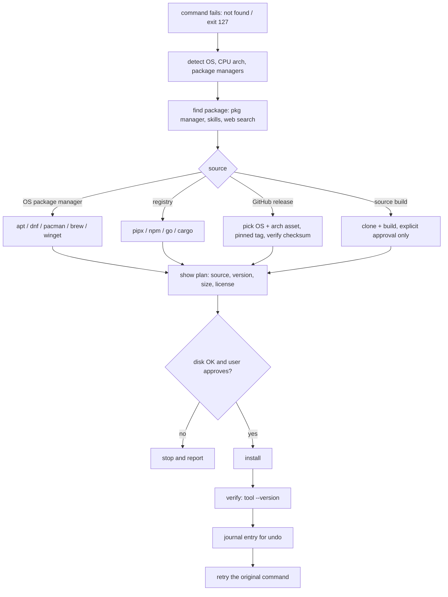

# WO-12 diagram

```mermaid
flowchart TD
  A[command fails: not found / exit 127] --> B[detect OS, CPU arch, package managers]
  B --> C[find package: pkg manager, skills, web search]
  C --> D{source}
  D -->|OS package manager| P[apt / dnf / pacman / brew / winget]
  D -->|registry| R[pipx / npm / go / cargo]
  D -->|GitHub release| G[pick OS + arch asset, pinned tag, verify checksum]
  D -->|source build| S[clone + build, explicit approval only]
  P --> H[show plan: source, version, size, license]
  R --> H
  G --> H
  S --> H
  H --> I{disk OK and user approves?}
  I -->|no| X[stop and report]
  I -->|yes| J[install]
  J --> K[verify: tool --version]
  K --> L[journal entry for undo]
  L --> M[retry the original command]
```
