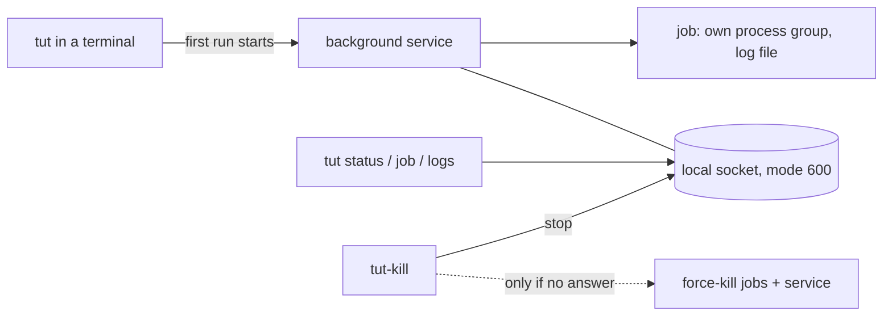

```mermaid
flowchart LR
  T[tut in a terminal] -->|first run starts| S[background service]
  S --- SOCK[(local socket, mode 600)]
  CLI[tut status / job / logs] --> SOCK
  S --> J1[job: own process group, log file]
  K[tut-kill] -->|stop| SOCK
  K -.->|only if no answer| F[force-kill jobs + service]
```
