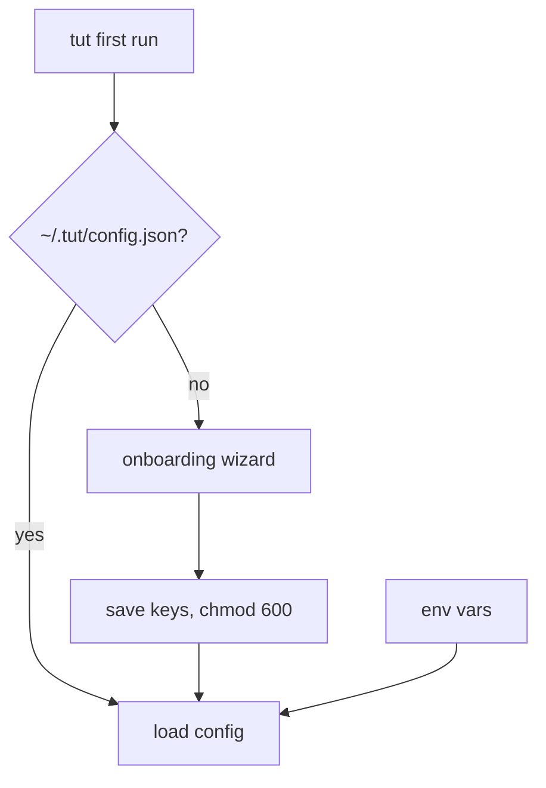

# WO-2 diagram

```mermaid
flowchart TD
  A[tut first run] --> B{~/.tut/config.json?}
  B -->|no| C[onboarding wizard]
  B -->|yes| D[load config]
  C --> E[save keys, chmod 600]
  E --> D
  ENV[env vars] --> D
```
