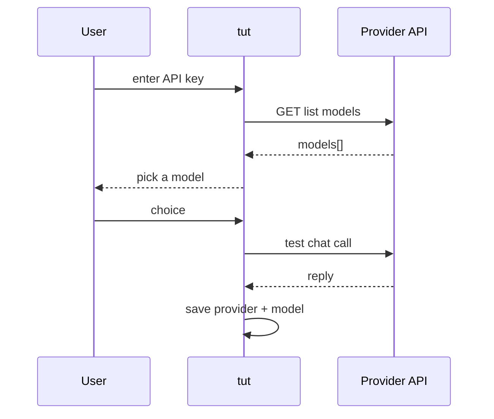

# WO-3 diagram

```mermaid
sequenceDiagram
  participant U as User
  participant T as tut
  participant P as Provider API
  U->>T: enter API key
  T->>P: GET list models
  P-->>T: models[]
  T-->>U: pick a model
  U->>T: choice
  T->>P: test chat call
  P-->>T: reply
  T->>T: save provider + model
```
