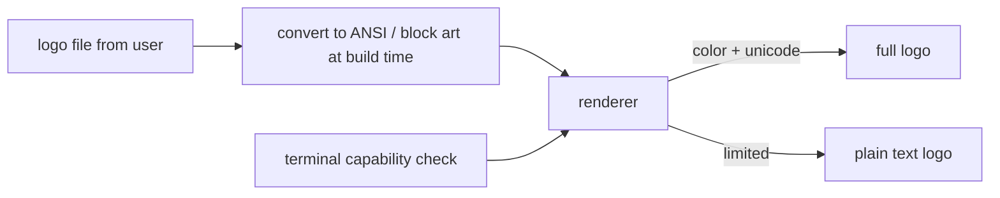

# WO-4 diagram

```mermaid
flowchart LR
  L[logo file from user] --> C[convert to ANSI / block art at build time]
  C --> R[renderer]
  T[terminal capability check] --> R
  R -->|color + unicode| F[full logo]
  R -->|limited| P[plain text logo]
```
