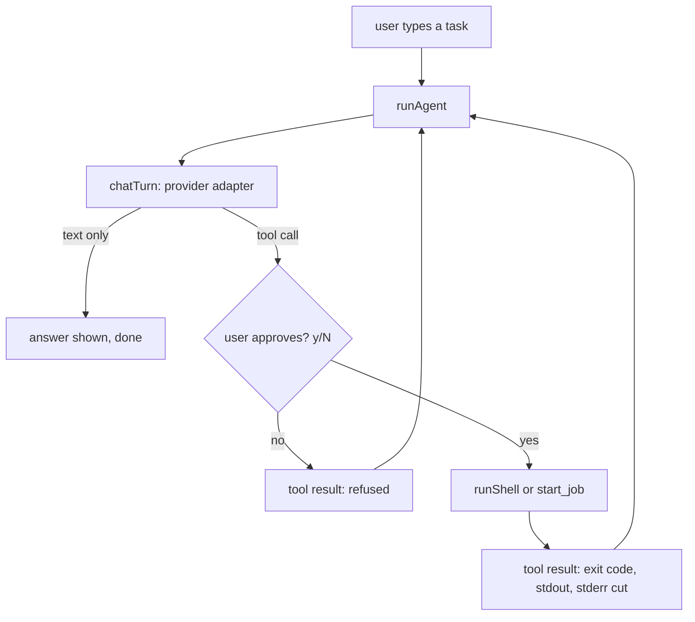

```mermaid
flowchart TD
  U[user types a task] --> A[runAgent]
  A --> L[chatTurn: provider adapter]
  L -->|text only| R[answer shown, done]
  L -->|tool call| P{user approves? y/N}
  P -->|no| T1[tool result: refused]
  P -->|yes| S[runShell or start_job]
  S --> T2[tool result: exit code, stdout, stderr cut]
  T1 --> A
  T2 --> A
```
