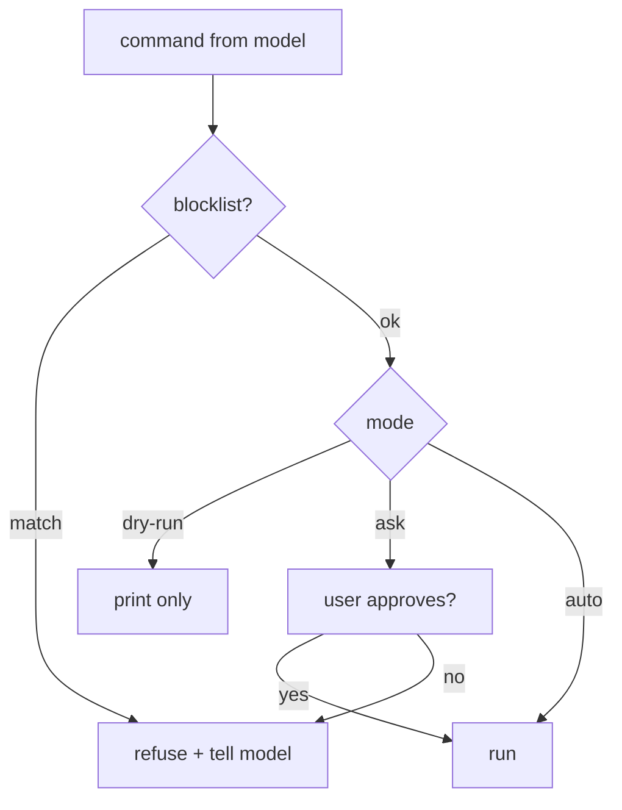

# WO-6 diagram

```mermaid
flowchart TD
  C[command from model] --> B{blocklist?}
  B -->|match| X[refuse + tell model]
  B -->|ok| M{mode}
  M -->|dry-run| P[print only]
  M -->|ask| Q[user approves?]
  M -->|auto| R[run]
  Q -->|yes| R
  Q -->|no| X
```
