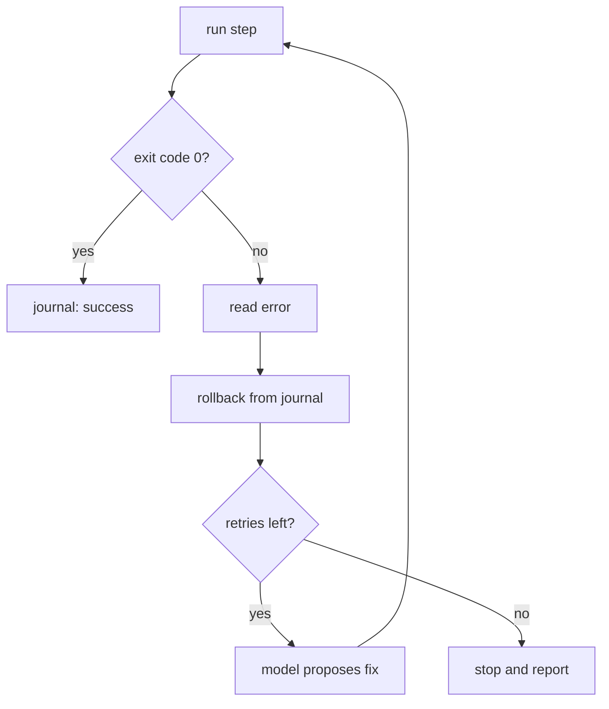

# WO-7 diagram

```mermaid
flowchart TD
  A[run step] --> B{exit code 0?}
  B -->|yes| C[journal: success]
  B -->|no| D[read error]
  D --> E[rollback from journal]
  E --> F{retries left?}
  F -->|yes| G[model proposes fix]
  G --> A
  F -->|no| H[stop and report]
```
