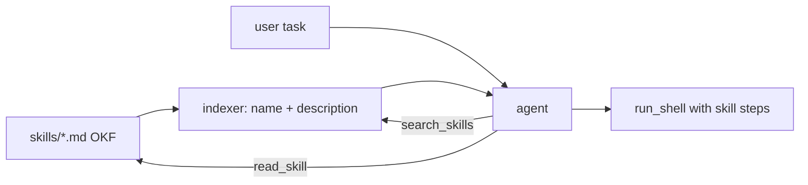

# WO-8 diagram

```mermaid
flowchart LR
  S[skills/*.md OKF] --> I[indexer: name + description]
  U[user task] --> A[agent]
  A -->|search_skills| I
  I --> A
  A -->|read_skill| S
  A --> R[run_shell with skill steps]
```
