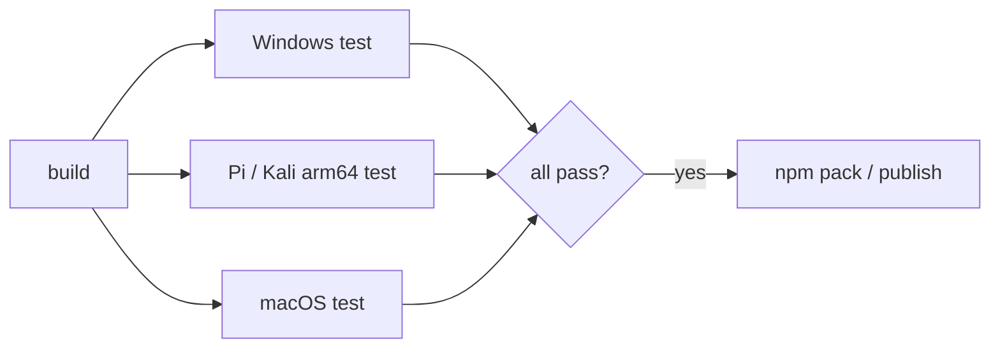

# WO-9 diagram

```mermaid
flowchart LR
  B[build] --> W[Windows test]
  B --> P[Pi / Kali arm64 test]
  B --> M[macOS test]
  W --> G{all pass?}
  P --> G
  M --> G
  G -->|yes| N[npm pack / publish]
```
